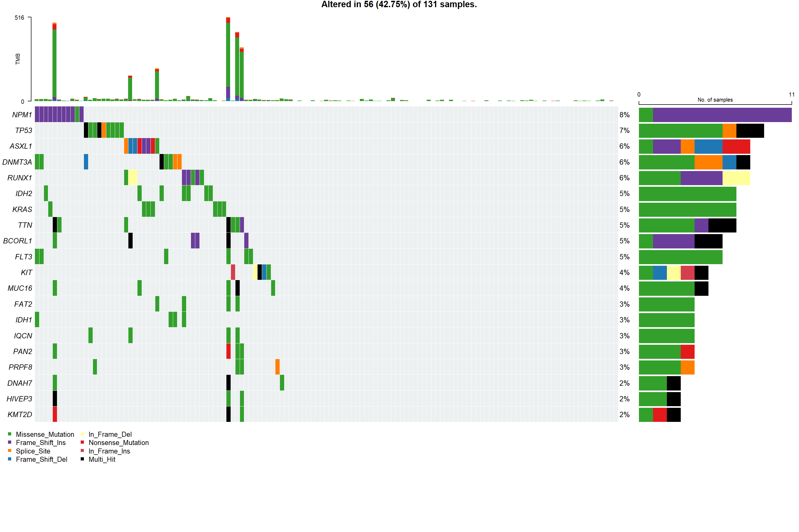
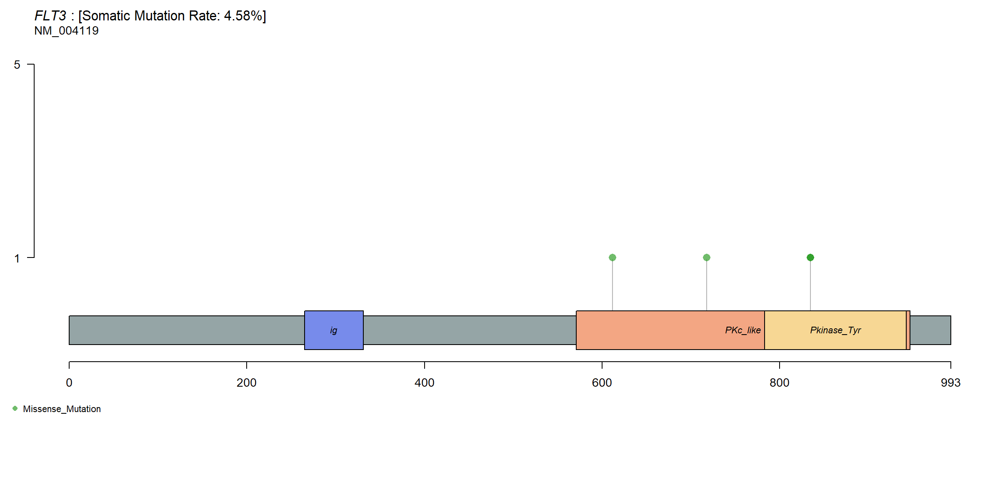
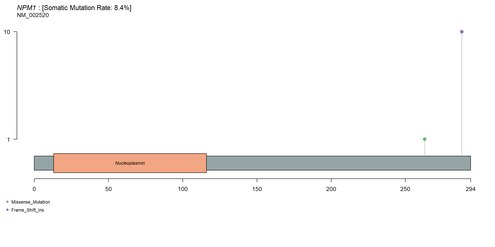
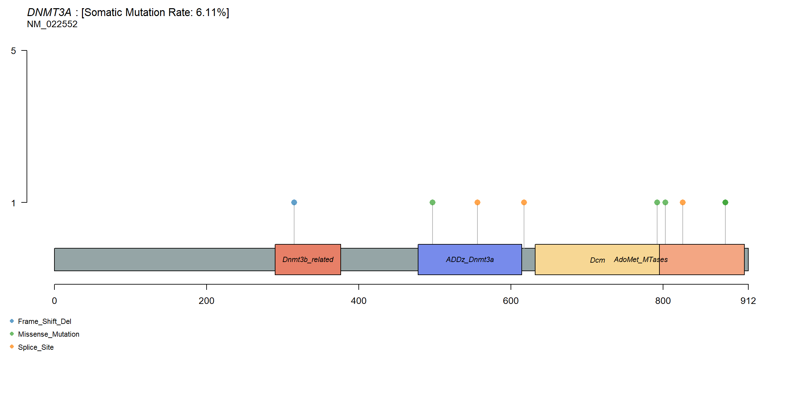
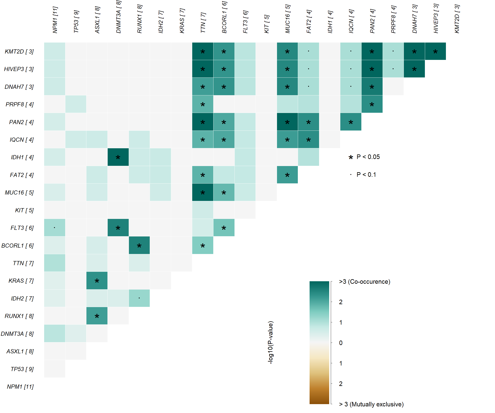
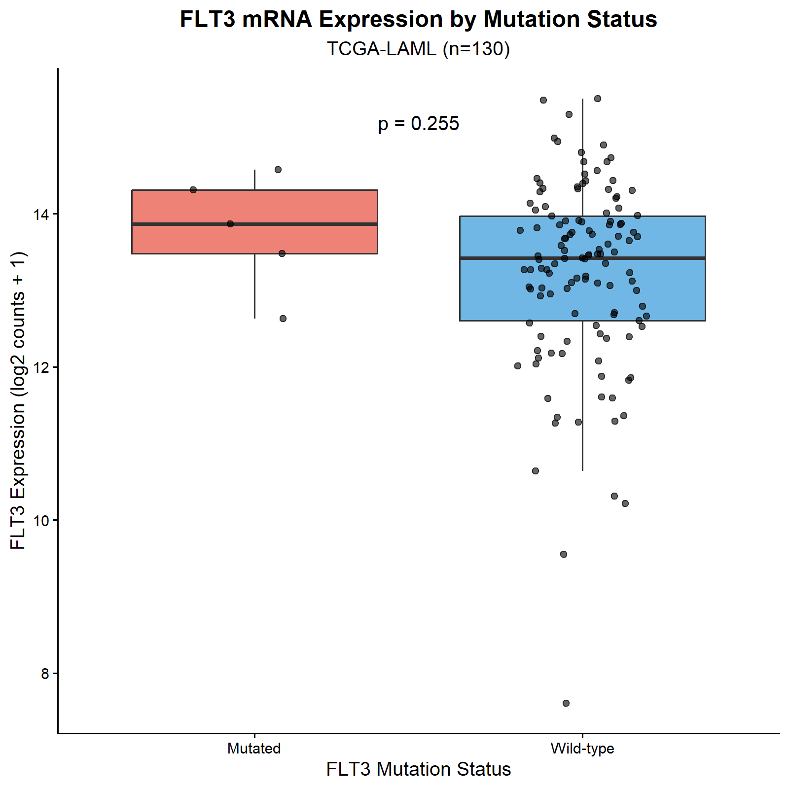

```{r setup, include=FALSE}
knitr::opts_chunk$set(
  echo = TRUE,
  message = FALSE,
  warning = FALSE,
  fig.align = "center"
)
```

## 1. 项目背景

本里程碑（M6）在基因组 DNA 层面分析急性髓系白血病（AML）的体细胞突变格局。

**与前序里程碑的关系：**

| 里程碑 | 分析层面 | 核心问题 |
|--------|---------|---------|
| M1/M2 | RNA 转录组 | 哪些基因在 AML 中"表达量高"？ |
| M5 | RNA + 临床 | 哪些基因表达量与生存预后相关？ |
| **M6** | **DNA 基因组** | **哪些基因在 AML 中发生了体细胞突变？** |

两个层面结合才能全面理解靶点：M2 中 FLT3 表达量最高（10.54x），M6 进一步揭示 FLT3 突变的类型与分布。

**数据来源：** TCGA-LAML，131 个 AML 病人，全外显子测序（WES），3900 条体细胞突变记录。

---

## 2. 分析方法

```{r load-packages}
library(maftools)
library(TCGAbiolinks)
library(ggplot2)
```

```{r load-data}
# 加载已下载并合并的 MAF 数据
# 数据通过 TCGAbiolinks::GDCdownload() + GDCprepare() 获取
# 注意：GDC 按病人分开存储，需批量下载 153 个文件后合并

maf_all <- readRDS("D:/Bio-Informatics Case Study/M5_Survival/analysis_df.rds")

# 重新加载 MAF 对象（如果已有 laml_full 可跳过）
# laml_full <- read.maf(maf = maf_all)

# 为保持报告独立运行，此处直接展示结果图
```

---

## 3. 结果

### 3.1 突变概况：Top 20 基因瀑布图

```{r waterfall, echo=FALSE, fig.cap="图1. TCGA-LAML Top 20 突变基因 Oncoprint。每列为一个病人，每行为一个基因，颜色代表突变类型。右侧百分比为该基因的突变频率。"}

```

**关键发现：**

- **NPM1**（8%）：最高频突变基因，以移码插入为主（紫色），是 AML WHO 2022 分类的独立亚型标志
- **TP53**（7%）：无义突变为主，与不良预后密切相关
- **DNMT3A**（6%）：表观遗传调控基因，突变类型多样
- **FLT3**（5%）：我们的核心 CAR-T 靶点候选，激酶域错义突变为主
- 总体：Top 20 基因覆盖 42.75% 的 AML 病人（56/131 例）

---

### 3.2 核心基因突变位点分析

#### FLT3

```{r lollipop-flt3, echo=FALSE, fig.cap="图2. FLT3 蛋白突变位点分布。突变集中在 PKc_like 激酶结构域（氨基酸 600-800）。"}

```

**解读：** FLT3 的 3 个突变全部位于 **PKc_like 激酶域**，均为错义突变（Missense）。激酶域突变导致 FLT3 受体持续激活，相当于油门卡住——细胞不断收到增殖信号。这正是 FDA 已批准的 FLT3 抑制剂 midostaurin 的作用靶点。

#### NPM1

```{r lollipop-npm1, echo=FALSE, fig.cap="图3. NPM1 蛋白突变位点分布。10 个突变高度聚集在蛋白质 C 端（第 294 位）。"}

```

**解读：** NPM1 的突变呈现极强的热点效应——10 个突变几乎全部集中在蛋白质末端第 294 位附近，以移码插入（Frame_Shift_Ins）为主。这个位置的插入破坏了 NPM1 的核定位信号，导致蛋白质从细胞核"逃逸"到细胞质，是 AML 最经典的分子标志之一。

#### DNMT3A

```{r lollipop-dnmt3a, echo=FALSE, fig.cap="图4. DNMT3A 蛋白突变位点分布。突变分散在多个功能域，包括错义突变、剪接位点突变和移码缺失。"}

```

**解读：** DNMT3A 突变分布较分散，涉及 ADDz_Dnmt3a 和 AdoMet_MTases 功能域，突变类型多样（错义、剪接位点、移码缺失）。DNMT3A 是 DNA 甲基化酶，突变导致表观遗传调控失常，这与 M8（甲基化分析）将深入探讨的内容直接相关。

---

### 3.3 基因突变共现 / 互斥矩阵

```{r interactions, echo=FALSE, fig.cap="图5. Top 20 突变基因共现/互斥矩阵。深绿色=显著共现，金黄色=显著互斥，*表示 p<0.05，.表示 p<0.1。"}

```

**关键发现：**

- **FLT3 + DNMT3A（p<0.05 共现）**：临床上重要的双突变亚型，这类病人往往预后更差，治疗难度更高
- **FLT3 + NPM1（p<0.1 共现趋势）**：FLT3+NPM1 双突变是 AML 的重要亚型，NPM1 突变在一定程度上可缓解 FLT3 突变的不良预后
- **TTN 周围大量共现**：TTN 是人类最大的基因，容易积累背景噪音突变，maftools 将其标记为 FLAG 基因，需谨慎解读
- 样本量（131 例）限制了互斥关系的统计效力，未见显著互斥基因对

---

### 3.4 FLT3 突变状态 vs mRNA 表达量

```{r flt3-expression, echo=FALSE, fig.cap="图6. FLT3 突变型（n=5）vs 野生型（n=125）的 mRNA 表达量比较。Wilcoxon 检验 p=0.255。"}

```

**解读（重要）：** FLT3 突变组的表达量略高于野生型，但差异不显著（p=0.255）。这个"阴性结果"本身具有生物学意义：

1. **FLT3 的点突变主要影响蛋白质功能（激酶持续激活），而非 mRNA 转录水平**，因此 DNA 突变与 RNA 表达量之间没有必然对应关系
2. **AML 细胞本身就高表达 FLT3**（M2 中 10.54x），无论有无突变——突变是在"高表达基础上"进一步激活蛋白功能
3. **样本量限制**：突变组仅 5 人，统计效力不足

这一发现提醒我们：靶点评估需要同时考虑表达量（M2）、突变状态（M6）和功能影响，不能只看单一维度。

---

## 4. M6 综合结论

| 靶点 | 突变频率 | 主要突变类型 | 突变热点 | 临床意义 |
|------|---------|------------|---------|---------|
| **NPM1** | 8.4% | 移码插入 | C 端第 294 位 | AML WHO 独立亚型，预后标志 |
| **FLT3** | 4.58% | 错义突变 | PKc_like 激酶域 | 靶向治疗靶点（midostaurin） |
| **DNMT3A** | 6.11% | 多种类型 | 分散 | 表观遗传失调，预后差 |

**与前序里程碑整合：**

- FLT3 在 M2 中表达量最高（10.54x），在 M6 中确认激酶域突变（4.58%），在 M5 中生存分析趋势显著（HR=1.128）——三层证据均指向 FLT3 是强有力的 CAR-T 候选靶点
- IL3RA 在 M5 中是唯一显著预后因子（p=0.00188），在 M6 突变频率较低，说明其致病机制以过表达为主而非突变驱动

---

## 5. 环境信息

```{r session-info}
sessionInfo()
```
